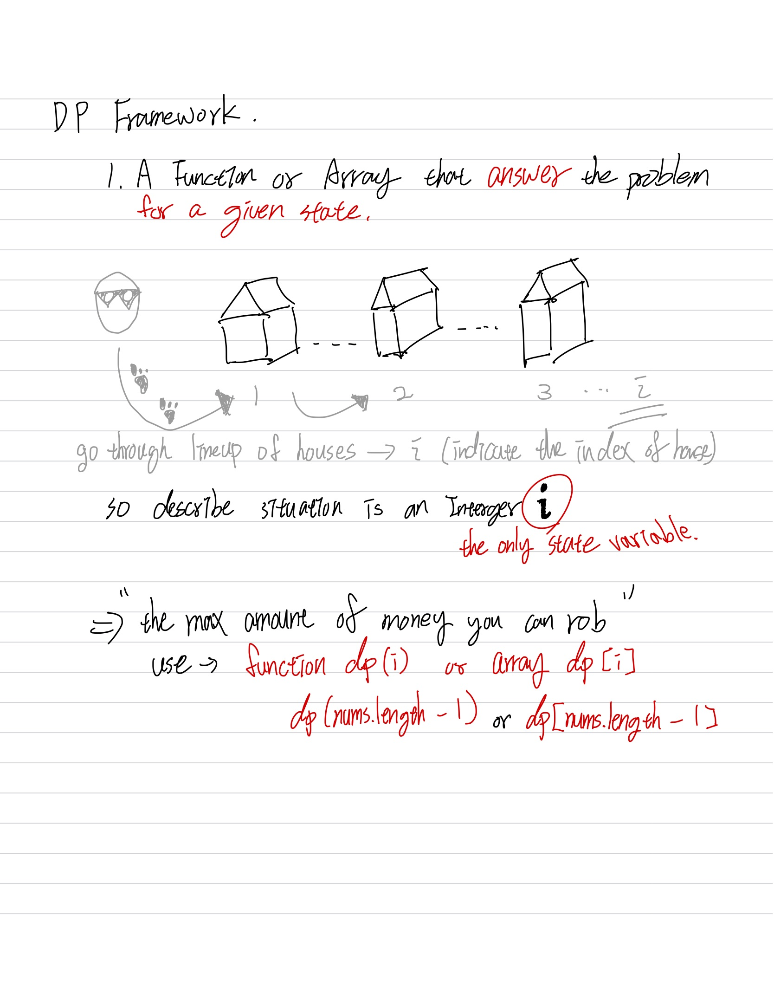
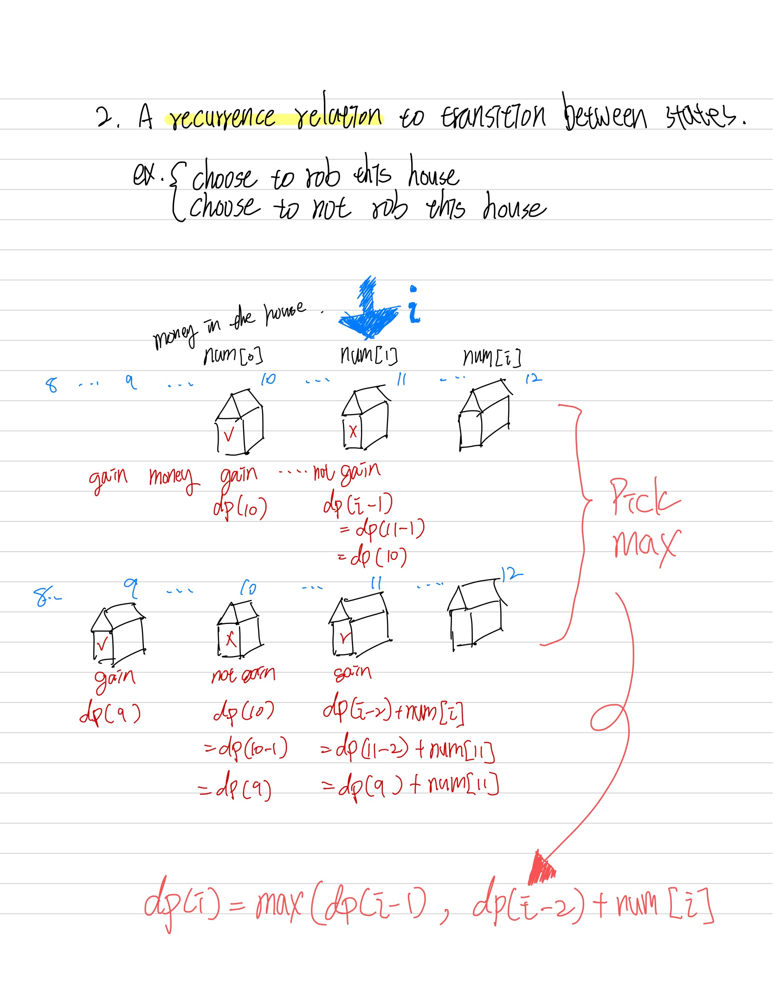
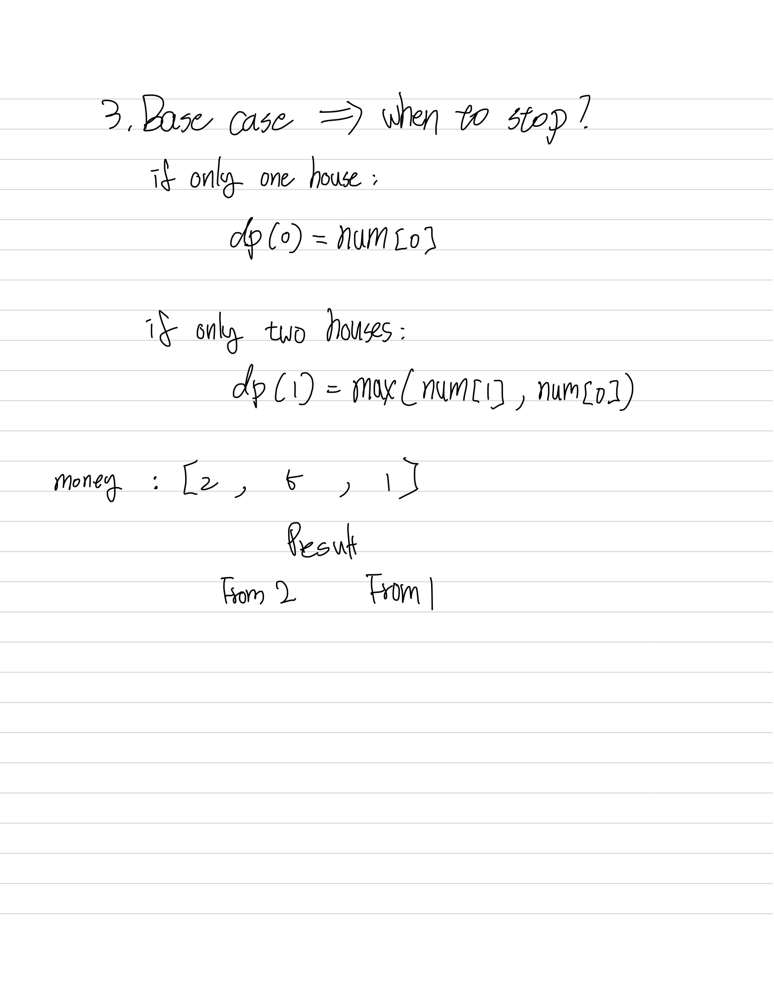

# Dynamic Programming
## characteristic of DP
1. <b>The first characteristic</b> that is common in DP problems is that the problem will ask for the optimum value (maximum or minimum) of something, or the number of ways there are to do something. For example:
    - What is the minimum cost of doing...
    - What is the maximum profit from...
    - How many ways are there to do...
    - What is the longest possible...
    - Is it possible to reach a certain point...
 
 
2. <b>The second characteristic</b> that is common in DP problems is that future "decisions" depend on earlier decisions. Deciding to do something at one step may affect the ability to do something in a later step. This characteristic is what makes a greedy algorithm invalid for a DP problem - we need to factor in results from previous decisions. Admittedly, this characteristic is not as well defined as the first one, and the best way to identify it is to go through some examples.
    - House Robber
    - Longest Increasing Subsequence

> how we can use the framework to develop an algorithm for this problem
1. A function or array that answers the problem for a given state

2. A recurrence relation to transition between states

3. Base cases
