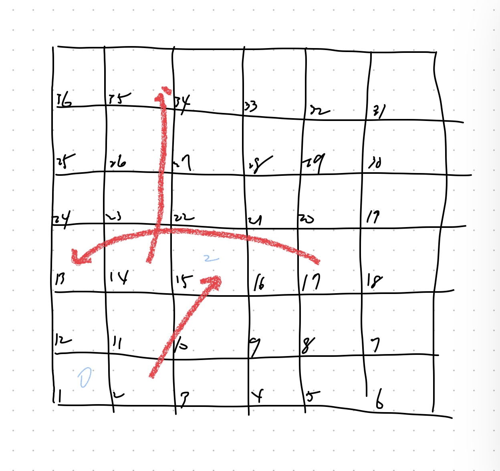

# 0000 - title
## Solution
### Algorithm 1 - BFS

#### Question

### Destination 1-6 from board[5][0]
![Destination 1-6 from board[5][0]](2.jpg)

#### Jump by labor and Destination 1-6 from board[3][2]
![Destination 1-6 from board[5][0]](3.jpg)

#### Path 1 -> 2 -> 15 -> 17 
![Destination 1-6 from board[5][0]](4.jpg)